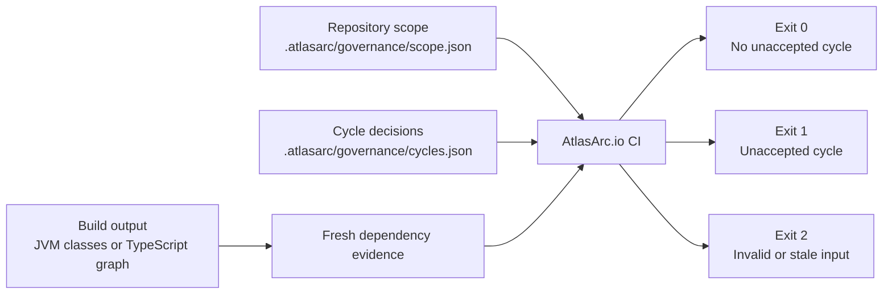

# AtlasArc.io CI

**Stop new dependency cycles without pretending an established codebase has none.**

Most cycle detectors answer a binary question: does a cycle exist? Real repositories need a more
useful one: is this a new architecture problem, an intentional dependency, or debt the team has
chosen to carry for now?

A build that fails forever on every known cycle is soon ignored or disabled. An undisclosed
exclusion can hide the next regression. AtlasArc.io CI takes a narrower approach: it first applies
the repository's explicit architecture scope and then compares fresh dependency evidence with
decisions committed in `.atlasarc/governance/cycles.json`. Known decisions remain visible and
reviewable; a new or incompletely accepted cycle fails the build.

AtlasArc.io CI is open source under Apache License 2.0. It supports Java, Kotlin, and TypeScript and
can run without IntelliJ or a paid plugin license. [AtlasArc.io for IntelliJ](https://atlasarc.io)
is the optional visual workbench for finding cycles and authoring or repairing decisions; this
repository provides the independent engine and build integrations that enforce those decisions.

## The workflow

AtlasArc.io CI combines three repository-owned inputs:

1. **Current evidence** describes the dependencies that exist now. JVM evidence comes from compiled
   classes and matching source roots; TypeScript evidence comes from dependency-cruiser JSON.
2. **Repository scope** describes generated, vendored, or deliberately fenced architecture units
   outside the governed evidence universe, in `.atlasarc/governance/scope.json`.
3. **Governance decisions** describe cycle-forming dependencies the team has accepted as
   `INTENTIONAL` architecture or acknowledged `DEBT`.

The evaluator validates all three inputs, removes scoped-out evidence, applies only decisions that
still match the retained dependencies, and then checks the remaining problem graph for cycles.



The process is deliberately evidence-first. AtlasArc.io CI does not invoke Maven, Gradle, npm, or
dependency-cruiser: your existing build produces the evidence, then the evaluator checks it. This
keeps the gate predictable and lets each repository retain control of its toolchain.

## One contract, three integrations

All three integrations use the same schemas, scope policy, matcher, module identity, coverage
rules, and cycle calculation. Choose the boundary that fits the owning build.

| | JUnit adapter | Standalone evaluator | ArchUnit adapter |
|---|---|---|---|
| Best fit | JUnit 5 projects that want the complete configured JVM, TypeScript, or mixed-stack verdict in ordinary tests | Non-JUnit pipelines or a tool-neutral process and machine-output boundary | Java/Kotlin projects whose architecture suite already imports classes through ArchUnit |
| Developer feedback | Runs in-process with ordinary IDE, Maven, and Gradle tests | Runs when a task, script, or developer invokes the process | Runs as a native `ArchRule` in the existing architecture test |
| Failure contract | JUnit assertion failure | Process exit code | ArchUnit violation |
| Output | Human evaluator detail in the test failure | Human text, JSON, or SARIF | Normal JUnit/ArchUnit reporting |
| Runtime input | `evaluator.json`: explicit JVM build roots and/or dependency-cruiser JSON | The same configured evidence | ArchUnit-imported classes plus matching source/class roots |

The JUnit adapter invokes the configured evaluator in-process; it does not spawn the standalone
JAR. The ArchUnit adapter instead maps the consuming suite's imported JVM classes directly into the
same core. `atlasarc-governance-core` remains the extension artifact for tools that own another
evidence adapter or workflow, not a separate end-user integration.

For JVM sources, the configured evaluator itself reuses ArchUnit's bytecode importer under the
hood. That is an evidence-acquisition implementation detail: JUnit-adapter consumers configure
class/source roots and call an assertion, while ArchUnit-adapter consumers import the classes up
front and receive a native `ArchRule`.

## Guides and contracts

- [Configure the evaluator](docs/evaluator-configuration.md) explains `evaluator.json`, JVM and
  TypeScript evidence, module identity, path resolution, freshness, output, and troubleshooting.
- [Run the evaluator from JUnit](docs/junit-adapter.md) explains the in-process assertion, build
  ordering, dependency setup, and failure contract.
- [Define repository analysis scope](docs/repository-scope.md) explains `scope.json`, portable
  JVM/TypeScript selectors, module semantics, fail-closed behavior, and audit output.
- [Govern cycle decisions](docs/governance-decisions.md) explains `cycles.json`, the decision
  workflow, scopes, ownership, Intentional/Debt semantics, record health, and review practices.
- [Establish a cycle-debt baseline](docs/cycle-debt-baseline.md) explains how to adopt the gate in a
  repository with existing cycles without broadly accepting future dependencies.
- [Run the verified examples](examples/verified-governance/README.md) provides copyable Java and
  TypeScript projects whose expected rejection and acceptance paths are checked on GitHub.
- [Documentation index](docs/README.md) routes to the guides, schemas, examples, and extension API.

The guides explain how to use the files. The bundled JSON schemas remain the exact machine
contracts.

## Run the verified examples

[](https://github.com/seamraworks/atlasarc-ci/actions/workflows/verified-examples.yml)

The [verified Java and TypeScript examples](examples/verified-governance/README.md) exercise the
published integrations as users consume them. Eight expected-outcome jobs prove that the JUnit
adapter, standalone JVM evaluator, ArchUnit adapter, and standalone TypeScript evaluator reject an
ungoverned cycle and pass the same cycle after a reviewed repository decision. The jobs publish
nothing and stay green only when rejection happens for the intended AtlasArc.io cycle reason.

## Run the configured evaluator from JUnit

`io.atlasarc:atlasarc-junit:1.4.0` is an in-process JUnit 5 assertion over the same configured
evaluator used by the CLI. It can therefore evaluate Java, Kotlin, TypeScript, or a mixed-stack
`evaluator.json` in an ordinary test without adopting ArchUnit's test API. Add it as a test
dependency:

```xml
<dependency>
  <groupId>io.atlasarc</groupId>
  <artifactId>atlasarc-junit</artifactId>
  <version>1.4.0</version>
  <scope>test</scope>
</dependency>
```

```kotlin
testImplementation("io.atlasarc:atlasarc-junit:1.4.0")
```

After the build has compiled JVM classes and/or generated the configured dependency-cruiser JSON,
one ordinary JUnit test runs the gate:

```java
import io.atlasarc.junit.AtlasArcGovernanceAssertions;
import org.junit.jupiter.api.Test;
import java.nio.file.Path;

class CycleGovernanceTest {
    @Test
    void repositoryCycleGovernance() {
        AtlasArcGovernanceAssertions.assertGovernance(
            Path.of(".atlasarc/evaluator.json")
        );
    }
}
```

Clean evaluation returns normally. Unaccepted cycles, invalid or stale evidence, and internal
errors become assertion failures containing the evaluator's human result. The assertion does not
generate evidence and does not consume ESLint or SonarJS reports; compile Java/Kotlin and generate
dependency-cruiser JSON before the test runs. See the [JUnit adapter guide](docs/junit-adapter.md)
for build-order and mixed-stack details.

## Install the standalone evaluator

AtlasArc.io CI `1.4.0` is published on Maven Central and requires JDK 21 or newer. Use the
[standalone JAR](https://repo.maven.apache.org/maven2/io/atlasarc/atlasarc-ci/1.4.0/atlasarc-ci-1.4.0-standalone.jar)
directly, or download the
[standalone ZIP](https://repo.maven.apache.org/maven2/io/atlasarc/atlasarc-ci/1.4.0/atlasarc-ci-1.4.0-standalone.zip)
for the executable, checksum, guides, schemas, examples, license, and notices.

To build the same distribution from source:

```shell
git clone https://github.com/seamraworks/atlasarc-ci.git
cd atlasarc-ci
mvn verify -Ppublish-cli
```

The executable and ZIP are created under `atlasarc-ci/target/`.

To try a JVM project, first create `.atlasarc/governance/cycles.json` in that project's Git root.
Repository scope is optional; a missing `scope.json` means the complete acquired architecture is in
scope. An empty decision set is valid and treats every detected in-scope cycle as unaccepted:

```json
{
  "$schema": "https://atlasarc.io/schemas/cycle-governance-v1.schema.json",
  "schemaVersion": 1,
  "records": {}
}
```

Save this evaluator configuration as `.atlasarc/evaluator.json`:

```json
{
  "$schema": "https://atlasarc.io/schemas/evaluator-config-v1.schema.json",
  "configVersion": 1,
  "repositoryRoot": "..",
  "sources": [
    {
      "id": "jvm:whole-project",
      "backend": "jvm-bytecode",
      "classDirectories": [{"path": "target/classes"}],
      "sourceRoots": [{"path": "src/main/java"}]
    }
  ]
}
```

Compile the target project, then run:

```shell
java -jar <path-to>/atlasarc-ci-1.4.0-standalone.jar evaluate \
  --config .atlasarc/evaluator.json \
  --format human
```

This first run establishes the useful default: no cycle is silently accepted. Refactor a reported
cycle, record deliberate decisions in `cycles.json`, or—starting with AtlasArc.io CI 1.1.0—establish
the current backlog as exact Debt before enabling the gate:

```shell
java -jar <path-to>/atlasarc-ci-<version>-standalone.jar baseline \
  --config .atlasarc/evaluator.json
java -jar <path-to>/atlasarc-ci-<version>-standalone.jar baseline \
  --config .atlasarc/evaluator.json --write
```

The first command previews a deterministic proposal; the second is the explicit, atomic mutation.
It selects a narrow set of dependency edges whose governance makes the current problem graph
acyclic, then adds one `REFERENCE`-scope `DEBT` record for each current concrete reference on those
edges. It preserves every existing decision and becomes a byte-level no-op when rerun against
unchanged evidence. Review and commit the resulting file, then keep `evaluate` as the ordinary
read-only gate. See the
[cycle-debt baseline guide](docs/cycle-debt-baseline.md) for the complete fail-closed workflow.

## Configure the standalone evaluator

`repositoryRoot` is resolved relative to the evaluator configuration file and may point anywhere
inside the owning Git repository. AtlasArc.io locates that repository and reads
`.atlasarc/governance/scope.json` and `.atlasarc/governance/cycles.json` from its root. Evidence
paths are repository-relative.

### Multi-module JVM projects

Label every class and source root with the same stable module name used when the governance
decision was created:

```json
{
  "$schema": "https://atlasarc.io/schemas/evaluator-config-v1.schema.json",
  "configVersion": 1,
  "repositoryRoot": "..",
  "sources": [
    {
      "id": "jvm:whole-project",
      "backend": "jvm-bytecode",
      "classDirectories": [
        {"path": "billing/target/classes", "module": "billing"},
        {"path": "orders/target/classes", "module": "orders"}
      ],
      "sourceRoots": [
        {"path": "billing/src/main/java", "module": "billing"},
        {"path": "orders/src/main/java", "module": "orders"}
      ]
    }
  ]
}
```

Do not mix named and unlabelled JVM roots in one source. Split packages are separate architecture
units per module; an unqualified decision that matches multiple module locations fails closed.

### TypeScript projects

Generate dependency-cruiser JSON with the project's pinned Node toolchain, then evaluate that
artifact:

```shell
npx depcruise --output-type json src > .atlasarc/depgraph.json
java -jar <path-to>/atlasarc-ci-1.4.0-standalone.jar evaluate \
  --backend typescript-artifact \
  --source-id typescript:frontend \
  --root . \
  --dependency-cruiser .atlasarc/depgraph.json
```

The equivalent reusable configuration is:

```json
{
  "$schema": "https://atlasarc.io/schemas/evaluator-config-v1.schema.json",
  "configVersion": 1,
  "repositoryRoot": "..",
  "sources": [
    {
      "id": "typescript:frontend",
      "backend": "typescript-artifact",
      "root": ".",
      "dependencyCruiserJson": ".atlasarc/depgraph.json"
    }
  ]
}
```

If source files are newer than the configured JVM bytecode or dependency-cruiser artifact,
evaluation is invalid instead of falsely clean.

### Output and exit codes

Use `--format human`, `--format json`, or `--format sarif`. Add `--output <path>` to write a file.
Machine output contains portable identities, record IDs, problem groups, and diagnostics; it omits
decision reasons, tickets, and absolute workstation paths.

| Exit | Meaning |
|---:|---|
| `0` | Governance is valid and no unaccepted cycle remains. |
| `1` | Evaluation is valid and one or more unaccepted cycles remain. |
| `2` | Configuration, schema, evidence freshness, acquisition, or governance validation failed. |
| `3` | An unexpected internal error occurred. |

## Use the ArchUnit adapter with an existing architecture suite

The ArchUnit adapter is the focused alternative when a Java/Kotlin project already imports its
architecture through ArchUnit. It maps that imported class universe into AtlasArc and exposes the
verdict as a native `ArchRule`. Accepted cycles pass; a new unaccepted cycle fails the test locally
and in CI.

One shared `cycles.json` may contain both JVM and TypeScript decisions. The ArchUnit rule evaluates
the Java/Kotlin records covered by its imported classes and leaves valid TypeScript records
`not-in-analysis`; those records do not fail the JUnit test. A malformed governance document or an
invalid record in the covered JVM evidence still fails closed. Use the JUnit adapter or standalone
evaluator with both evidence sources when one integration needs the complete mixed-stack verdict.

The ArchUnit adapter is published on Maven Central as
`io.atlasarc:atlasarc-archunit:1.4.0`.

Maven:

```xml
<dependency>
  <groupId>io.atlasarc</groupId>
  <artifactId>atlasarc-archunit</artifactId>
  <version>1.4.0</version>
  <scope>test</scope>
</dependency>
<dependency>
  <groupId>com.tngtech.archunit</groupId>
  <artifactId>archunit-junit5</artifactId>
  <version>1.4.2</version>
  <scope>test</scope>
</dependency>
```

Gradle:

```kotlin
testImplementation("io.atlasarc:atlasarc-archunit:1.4.0")
testImplementation("com.tngtech.archunit:archunit-junit5:1.4.2")
```

Java recipe for a module-less project:

```java
package architecture;

import com.tngtech.archunit.junit.AnalyzeClasses;
import com.tngtech.archunit.junit.ArchTest;
import com.tngtech.archunit.lang.ArchRule;
import io.atlasarc.archunit.AtlasArcGovernanceRules;
import java.nio.file.Path;

@AnalyzeClasses(packages = "com.example")
class CycleGovernanceTest {
    @ArchTest
    static final ArchRule accepted_cycles_do_not_fail =
        AtlasArcGovernanceRules.governedCycles()
            .fromRepository(Path.of("."))
            .forAnalysisSource("jvm:whole-project")
            .withSourceRoot(Path.of("src/main/java"))
            .withClassRoot(Path.of("target/classes"))
            .build();
}
```

For a multi-module imported class set, call `withModuleSourceRoot(name, path)` and
`withModuleClassRoot(name, path)` for every module. The class roots make attribution deterministic
even when modules contain the same package and source-file names.

## What a governance decision means

The canonical file is `.atlasarc/governance/cycles.json`. A package-level JVM decision looks like:

```json
{
  "$schema": "https://atlasarc.io/schemas/cycle-governance-v1.schema.json",
  "schemaVersion": 1,
  "records": {
    "accept-order-to-billing": {
      "analysisSource": {
        "id": "jvm:whole-project",
        "backend": "jvm-bytecode",
        "language": "java"
      },
      "scope": "package",
      "ownerSide": "source",
      "source": {"architectureUnit": "com.example.orders", "module": "orders"},
      "target": {"architectureUnit": "com.example.billing", "module": "billing"},
      "referenceIds": [],
      "kind": "DEBT",
      "reason": "Existing coupling tracked for removal.",
      "ticket": "ARCH-42"
    }
  }
}
```

`INTENTIONAL` records describe accepted architecture. `DEBT` records preserve an explicit cleanup
obligation, and `DEBT` wins when records overlap. A decision never deletes the dependency from the
structural model. AtlasArc.io removes fully governed concrete references only from the cycle problem
graph and then checks that graph for strongly connected components.

Coverage is fail-closed: if one concrete reference on a governed-looking edge remains uncovered,
the edge remains part of cycle detection. A stale, ambiguous, or invalid record cannot quietly make
the build green.

The bundled schemas are authoritative:

- [`cycle-governance-v1.schema.json`](atlasarc-governance-core/src/main/resources/io/atlasarc/governance/cycle-governance-v1.schema.json)
- [`repository-scope-v1.schema.json`](atlasarc-governance-core/src/main/resources/io/atlasarc/scope/repository-scope-v1.schema.json)
- [`evaluator-config.schema.json`](atlasarc-ci/src/main/resources/evaluator-config.schema.json)

## Project modules

All artifacts use the `io.atlasarc` group, share one version, and are released together.

| Artifact | Responsibility |
|---|---|
| `atlasarc-governance-core` | Portable schemas, repository scope, evidence contract, validation, matching, coverage, and deterministic cycle verdict. |
| `atlasarc-ci` | Standalone configuration, JVM/TypeScript acquisition, renderers, exit codes, and executable distribution. |
| `atlasarc-junit` | JUnit 5 assertion over the configured evaluator, including JVM, TypeScript, and mixed-stack input. |
| `atlasarc-archunit` | JVM evidence acquisition and the Java-friendly native ArchUnit rule. |

Adapters can depend only on the portable engine:

```kotlin
implementation("io.atlasarc:atlasarc-governance-core:1.4.0")
```

That coordinate is the current cycle-governance release and includes the repository-scope APIs
described below.

Create a `GovernanceEvidenceSnapshot`, wrap it in `GovernanceEvaluationInput`, and call
`CycleGovernanceEvaluator.evaluate`; pass `RepositoryScopeEvaluationContext` when the repository
uses scope policy. Tools that provide an explicit baseline workflow can call
`CycleDebtBaselinePlanner.propose` to obtain a pure proposal and diagnostics before owning consent
and a revision-checked write. The core has no IntelliJ, ArchUnit, Node, or build-tool dependency.
Evidence adapters own acquisition; the core owns validation, matching, coverage, cycle calculation,
baseline proposal semantics, and deterministic result contracts.

## Deliberate boundaries

AtlasArc.io CI governs repository dependency cycles. It is not:

- a general architecture-rule language;
- a metrics, complexity, coverage, or quality gate;
- a build runner;
- a hosted service or pull-request dashboard; or
- a replacement for ArchUnit, ESLint, Sonar, or dependency-cruiser rules.

Normal evaluation never edits `cycles.json` and does not read workspace-local Safe Havens. The
separate `baseline --write` adoption command changes governance only after explicit intent; it is
never run implicitly by evaluation. Only committed repository governance can affect a build verdict.

## Build and release

```shell
mvn verify -Ppublish-cli
```

The build requires JDK 21. The regular `mvn verify` gate runs the complete test suite, checks module
boundaries, and creates the source and API-documentation companions required for Maven Central. The
`publish-cli` profile additionally builds the executable `standalone` JAR, its checksum, and the
attached `standalone` ZIP.

Release builds attach the standalone JAR and ZIP to the `io.atlasarc:atlasarc-ci:<version>` Maven
component. Releases run from CircleCI and remain behind explicit patch, minor, major, or as-is
approval jobs. No artifact is published merely by pushing a commit or running the local build.

## Compatibility, security, and license

The four artifacts follow semantic versioning. Governance schema and result versions are
independent protocol versions; unsupported newer documents fail closed. Before 1.0, minor releases
may adjust public APIs. From 1.0 onward, incompatible public API or contract changes require a major
release.

Report security issues privately to `support@atlasarc.io`; do not open a public issue for an
unfixed vulnerability. See [SECURITY.md](SECURITY.md).

AtlasArc.io CI is licensed under the [Apache License 2.0](LICENSE). Runtime dependency licenses are
summarized in [THIRD-PARTY-NOTICES.md](THIRD-PARTY-NOTICES.md) and retained in the standalone
distribution.
